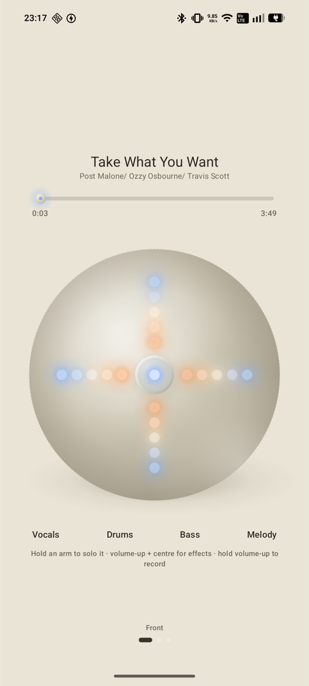
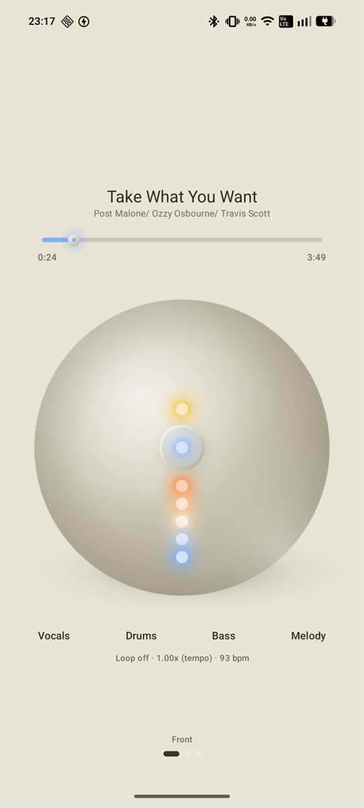
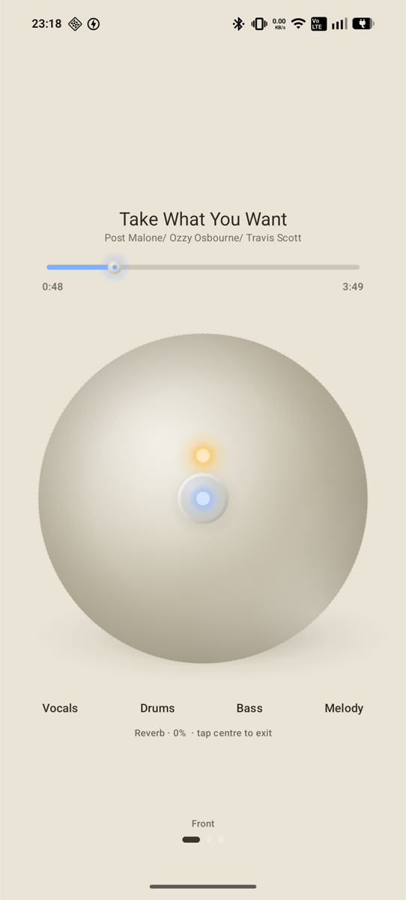
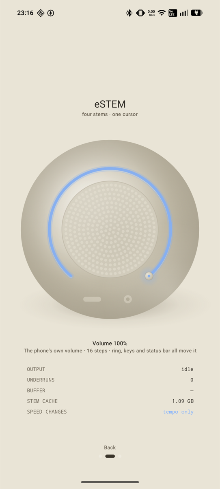
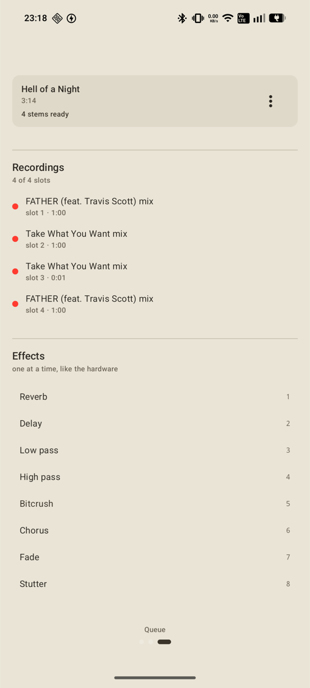

# eSTEM

An Android replica of the Kanye/Kano Stem Player, for local files.

The player screen is a faithful puck with the hardware's gesture language; library, import and
settings are ordinary Material 3 screens. Separation runs off-device, on a machine on the same
Wi-Fi — [see why](#why-separation-is-not-on-the-phone).

<p align="center">
  
  
  
</p>
<p align="center">
  <em>Playing — each arm is a stem, lit by that stem's own signal&nbsp;&nbsp;·&nbsp;&nbsp;hold the
  centre for loops &amp; speed&nbsp;&nbsp;·&nbsp;&nbsp;centre + volume-up for the effects rack</em>
</p>

<p align="center">
  
  
</p>
<p align="center">
  <em>Back — volume ring and a live spec plate&nbsp;&nbsp;·&nbsp;&nbsp;Queue — engine, server and
  library&nbsp;&nbsp;·&nbsp;&nbsp;four recording slots and the eight effects</em>
</p>

> Unaffiliated with Kanye West, Kano Computing or Stem Player. This is a personal reimplementation
> for local audio files, not a product, and ships no copyrighted assets — the face is drawn in
> code. Bring your own music; the tracks in the screenshots are the author's own library.

## Modules

| Module | What it owns |
|---|---|
| `app` | Compose UI, navigation, manual DI (`AppContainer`), the puck's gesture state machine, the two-deck mixer |
| `core-audio` | C++/NDK. Oboe stream, two `StemDeck`s, the WSOLA `TimeStretcher`, 8-effect rack, WAV recorder, `PcmDecoder`. Plus `BeatDetector`, which is Kotlin |
| `core-separation` | The `StemSeparator` seam, the separation-server client, WorkManager foreground worker, scheduler |
| `server` | Python + demucs. Runs htdemucs off-device and speaks raw PCM over HTTP |
| `core-data` | Room entities/DAOs, SAF import, stem cache on disk |
| `core-design` | Palette, theme, puck geometry and renderer |

## How it fits together

1. **Import** — SAF picker → `LibraryRepository.import` persists the URI permission, probes tags
   and stream parameters, inserts a `PENDING` track.
2. **Separate** — `SeparationScheduler` enqueues unique work per track. `SeparationWorker` runs in
   the foreground and writes four headerless interleaved 16-bit PCM files to
   `filesDir/stems/<trackId>/`. With the server engine the work is an upload, a poll and four
   downloads; the foreground notification still matters, because the phone must stay awake for it.
3. **Grid** — the same worker then reads the drums stem back and finds the pulse. It is the one
   moment in the app's life when an isolated drum track exists and nothing is playing, and a grid
   is what loops and beat-matching are both measured against.
4. **Play** — the native engine **memory-maps** those four files behind **one shared cursor** in
   **one** Oboe stream. Stems cannot drift apart because there is only one playback position in
   existence. Loading a track allocates nothing and decodes nothing.

Signal path per render callback:

```
deck A.render ┐
              ├→ effects rack → master gain → limiter → recorder tap → stream
deck B.render ┘   (4 mmapped stems each, summed, each behind its own cursor)
```

Nothing in that callback allocates, locks, or calls into JNI. Every gain is ramped, including
isolate and mute, so state changes fade instead of clicking.

## Separation engines

`StemSeparator` has two implementations behind one contract:

- **`RemoteSeparator`** (installed) — sends the track to a machine on the same Wi-Fi running
  htdemucs, and writes the four stems it sends back. See [`server/`](server/README.md).
- **`PassthroughSeparator`** — decodes the source into all four stem slots at quarter volume, so
  the four sum back to the original. Every slider moves the whole mix, so it is not musically
  useful, but it is the cleanest possible test of the playback path: any comb filtering heard here
  is engine drift, not a separation artefact.

Chosen on the Queue page; the choice is persisted and re-installs the separator immediately, so
already-queued work picks it up. Choosing the server when the server is down does **not** quietly
fall back to passthrough — a silent fallback would fill the stem cache with four copies of the mix
that look exactly like a successful separation. The track fails and says why instead.

### Why separation is not on the phone

It was built on-device first, with the `StemSplitio/htdemucs-onnx` export and ONNX Runtime's Java
API, and it does not work. The export's input is **statically shaped** `(1, 2, 343980)` — 7.8
seconds, fixed in the graph — so the segment cannot be shortened, and one segment needs several
gigabytes. On a 7.6 GB phone the process reached 3.9 GB resident and was killed partway through
every track; WorkManager restarted it, so the bar sat at 2–8% forever while the phone got hot. The
graph is also 24,917 nodes, three quarters of it shape plumbing, so it was never going to be fast.

That path is gone rather than left switched off, along with 60 MB of ONNX Runtime native libraries
— the debug APK went from 92 MB to 21 MB. What replaced it separates a 3:49 track in 16 seconds.

### The wire

The phone uploads **decoded PCM, not the original file**. It already decodes with MediaCodec for
its own stem cache, so sending that removes every format question from the server: no ffmpeg, no
container parsing, no codec that decodes differently at each end. The response is the same format,
so a downloaded stem is written into the cache byte for byte.

Stems are addressed **by name** — `drums`, `bass`, `other`, `vocals`. demucs' order is not our
order, and mapping the two by index is a mistake with no symptom other than the wrong slider
moving. `Stem.fileName` already matches the server's names, so it is a lookup, not a count.

## The three pages

The app is one device seen from three sides, swiped horizontally. Playback never stops when you
move between them — the player lives in `PlayerController`, not in any page.

1. **Front** — the puck, drawn from directly above against the warm beige the device is
   photographed on. A matte cream body with a finely knurled rim, four arms of LEDs in a cross,
   and a raised centre button, with the track title and a scrub bar above it. Two details carry
   the likeness: an unlit LED is drawn as *nothing*,
   because the plastic is opaque until something lights up behind it; and LED colour tracks
   distance from the centre — warm orange close in, cooling to blue at the outer end, which is
   why one arm in the reference photo is orange at one end and blue at the other.
2. **Back** — perforated speaker grille, the volume ring around it, USB-C and 3.5 mm moulded into
   the rim, plus a live spec plate (stream rate, underruns, stem-cache size). The ring is
   **dragged** to set the volume, and the phone's rocker still works as well.
3. **Queue** — add music from the phone, the library, the four recording slots, the effects list.

## Drawing it as an object

The body is shaded as a sphere lit by one key light from the upper left, and four things do the
work — in this order, because the order is what makes it read:

1. **A cast shadow.** [`PuckLayout`](core-design/src/main/java/com/sss/estem/design/puck/PuckGeometry.kt)
   deliberately leaves the body at 88% of the canvas, and the margin is where the shadow goes. An
   object with nowhere to cast one reads as a flat disc however carefully the face is shaded. It is
   an ellipse, not a circle, because it lands on a surface receding away from the viewer.
2. **A body gradient that reaches a genuinely dark terminator**, rather than stopping at
   mid-shadow.
3. **Occlusion at the silhouette**, so the edge turns away on every side.
4. **Bounce light** along the lower-right rim — light coming back up off the surface underneath.
   This is the one the eye actually reads as roundness, and the easiest to get wrong: drawn as
   stacked arcs it bands into visible crescents, because a stroked arc has hard ends and hard
   sides. It is a gradient anchored just *outside* the silhouette instead, which is bright exactly
   where the bounce lands and has nothing to seam.

The same trick settles the buttons. The centre is a raised cap and the rim buttons are dishes
pressed in, which is the same shading inverted — lit where the key lands versus dark where it
does. Both use one closed ring carrying a light-to-dark gradient across it rather than a lit arc
opposite a dark arc: two arcs leave their ends showing as a floating C, so the ring has to close
and the *shading* is what gives it direction.

## What makes the panel change colour

The front is not one fixed set of colours. Three things drive it, two of them taken from what is
actually documented about the device:

1. **Position along the arm.** Warm orange near the centre, through warm white, cooling to blue at
   the outer end. This is the ramp visible in the reference photograph, where a single arm is
   orange at one end and blue at the other. Implemented as `LedPalette.ledForPosition`.
2. **The live audio.** The device's lights "flash in time with the music", so each arm's LEDs are
   driven by that stem's own signal — brightness swings with it and loud passages push the whole
   arm toward its cool end. The engine measures a per-stem envelope in the render callback
   (`StemDeck::stemEnergy`, fast attack / slow release like a VU meter) and the UI polls it at
   60 Hz. It is measured **before** the slider gain, so a stem turned right down still flickers on
   the few LEDs it has left.
3. **Device state**, which overrides both: **red** while recording, **amber** while soloing, and
   **blue across the whole panel** while the two decks are locked to one tempo — matching the
   hardware's red record line and blue pairing mode. The order matters and is the order they are
   listed in: recording is the loudest claim the device can make, then a held solo, then sync.
   Blue takes the entire face rather than one arm because sync is a fact about the machine, not
   about a stem.

Not implemented: per-song curated palettes. Some coverage claims Ye authored a palette per track,
but that could not be corroborated, so it is not built on an unverified premise.

## Puck gestures

The arms are radial, so **distance from the centre is the level** — which is what the hardware's
"slide away from the centre to increase" actually means.

| Gesture | Effect |
|---|---|
| Drag **outward** along an arm | that stem louder |
| Drag **inward** toward the centre | that stem quieter |
| **Hold an arm** | solo that stem **for as long as you hold it**; let go and everything returns. Hold several arms to solo them together. |
| Centre tap | pause → strip effects → play |
| Drag the bar under the title | **scrub** — the cursor chases your finger and pitches with it |
| **Centre + volume-up** | effects menu — the first two arms select 1 of 8, the rest set intensity |
| **Hold centre** | loops & speed menu — first two arms set the loop length, the rest the speed |
| **Centre + volume-down** | slider lock |
| **Hold volume-up** | record 60 s of the live mix (4 slots, oldest rolls off) |

Solo is momentary rather than a toggle, and it restores by itself: isolate is a separate mask over
the mix that never touches the slider gains, so there is no previous state to save because nothing
was overwritten. That only holds if the gains genuinely do not move while a solo is held, so while
any finger is soloing the face stops being four faders — a second finger can join the solo by
holding its own arm, but it cannot drag a level. Otherwise a stray drag under a held finger would
rewrite a slider that the release then "restores" to the wrong place.

**The bar scrubs.** It used to seek once on release, because moving the cursor is a step
discontinuity in the waveform and sending sixty of those a second is a buzz, not a scrub. Now the
deck reads at a fractional rate, so the drag steers the cursor's *speed* rather than teleporting
it: the audio chases the finger, pitches up and down with it, and runs backwards when the finger
does. Pitch tracking the drag is the point — a scrub with the pitch held still sounds like a
search, not like a hand on a record — so pitch-lock is suspended for the duration.

A finger can outrun any playable rate, though: a full-width bar over a four-minute track is about
0.7 seconds of music per pixel. Past about 1.2 s of error the cursor stops chasing and jumps
instead, through the deck's own 3 ms seek fade, because a long rush toward somewhere the finger
has already left is worse than a silent cut to where it is now. Fine movements stay a real scrub;
big ones become a series of inaudible seeks. Either way the release lands exactly on the target
rather than wherever the servo had reached.

That fade is `StemDeck::seekFrames` handing over a `pendingSeek_` rather than writing the cursor
under the running callback.

**The face has one button.** Prev, next and power used to be moulded into the rim. Seeking is now
a bar under the title, which does that job better than two taps did, and the object is quieter for
losing all three. `PuckButton` still carries them and `PlayerController` still handles them, so a
gamepad can arrive as the same button-down/button-up intents. The slider lock was the centre+power
chord and went unreachable with it; it is now **centre + volume-down**, sitting symmetrically
opposite the effects chord on the one part of the hardware's button set the phone physically has.

The phone's own volume rocker *is* the puck's rocker (`MainActivity.dispatchKeyEvent`), which is
why there is no volume control drawn on the face.

## Speed without pitch

The deck reads at a fractional rate through a four-point Catmull-Rom interpolator, which is what
makes scrubbing, speed and beat-matching all the same mechanism. On its own that is a turntable:
faster is higher. For tempo alone the deck reads through a **WSOLA time-stretcher** instead —
overlapping grains of the source overlap-added at a different spacing than they were taken, so
nothing is ever read at anything but its own rate and the pitch does not move.

Grains cannot be laid on a fixed grid; butting two together at an arbitrary phase is what makes
naive overlap-add sound like a flanger. So each grain is searched for — the offset within ±10 ms
whose material best continues the tail of the grain already emitted, by normalised cross-correlation
on a boxcar-decimated mono sum.

**The search runs once and all four stems use the answer.** That is the whole reason this can exist
here. Searching per stem gives four different offsets, which is four stems shifted in time by
different amounts — exactly the drift the single shared cursor exists to prevent, reintroduced a
grain at a time.

Switching the stretcher in and out is a 12 ms crossfade between the two read paths rather than a
splice, because the overlap buffer runs about half a grain behind the cursor and the two are never
in phase. Resetting it — on a seek, a loop wrap, or engaging it mid-track — pre-loads the grain that
*would* have been emitted one hop ago, so it starts at full level instead of tapering up from
silence over 20 ms.

Reverse is always a turntable. Overlap-adding grains backwards is not a scrub.

## The beat grid

Loops that do not land on a beat are worse than no loops, and beat-matching needs to know where the
beats are, so both wait on a grid. It is measured once, by the separation worker, from the drums
stem it has just written.

Beat trackers normally open with a spectral flux onset detector, because in a full mix the only way
to tell a kick from a bass note is which frequencies moved. Here the drums arrive on their own — the
separation has already done that half of the job — so the onset function is plain broadband energy
flux in the log domain, which needs no FFT and reads the file once.

Then two passes: an autocorrelation for roughly how far apart the onsets are, refined by parabolic
interpolation through the peak; then a comb search over period **and phase** together. The second
pass is what produces a usable grid — autocorrelation gives a spacing with no idea where the
downbeat is, and being right about the spacing while wrong about the phase puts every loop point
exactly off the beat.

**It is allowed to answer "I don't know."** A grid nothing checked is a grid loops will snap to, so
two things have to hold before one is reported:

- **Peakiness** — the mean of the envelope's loudest 5% against its overall mean. Percussion leaves
  a nearly empty envelope with tall spikes; sustained material leaves a low one that wobbles, and a
  wobble has a period the comb will lock onto perfectly happily. Measured across the eight separated
  drum stems on hand this ran **8.6 to 16.6**, against **5.4** for white noise, **5.0** for a
  swelling pad and **3.4** for a bare sine. The gate sits at 7.
- **Phase contrast** — how far the winning phase stands above the other phases of the same period.
  Kept as a floor only, and deliberately a low one: the winner is the best of a few thousand
  candidates, and the best of a few thousand draws beats their average on any material at all. It
  scored 1.0 on white noise. Peakiness does the real work; this only catches unmetred percussion.

Tempo candidates are weighted by a log-normal prior centred on 120 bpm, because a comb at half
tempo hits every other beat and scores exactly as well per hit — nothing in the signal itself
distinguishes the two.

Tracks separated before any of this existed have no grid, and re-separating to get one would be
minutes of work to recover seconds of it. **⋮ → Find beat grid** reads the drums already on disk.

## Two songs

`Engine` holds two `StemDeck`s and sums both into the same buffer. That is the entire mechanism:
one stream, one cursor per song, and no clock anywhere for them to drift against. The deck never
assumed it was the only one — it renders additively into a buffer it does not own and carries its
own share of the mix as a ramped output gain.

The crossfader is **equal-power**, cosine against sine. Two different songs are uncorrelated, so
their powers add where their amplitudes do not, and a linear fade audibly dips through the middle.

**Sync is two things, and the second is the one people forget.** Matching tempo alone leaves two
tracks running at the same speed with their downbeats in different places, which sounds worse than
not matching at all. So the followed deck is pulled to the other's effective tempo through the
stretcher *and* seeked so its position within the bar equals the leading deck's.

It is then held rather than set and forgotten. The two tempi come from an estimator accurate to a
fraction of a per cent, and a fraction of a per cent is a beat of drift every few minutes — so a
servo re-reads the phase every two seconds and trims the rate by up to 1% to cancel it. A trim
rather than a seek: a seek is a fade, and a fade every two seconds is audible, whereas 0.2% for two
seconds moves the phase by milliseconds and is not.

Semi-manual is sync plus your own finger on the crossfader. **AUTO 8** is sync, start the other
deck, and walk the crossfader across eight bars of the current tempo — then hand the puck's focus
to the deck that has just become the audible one.

The face drives one deck at a time, because it has four arms and not eight. Which one is the deck
lit blue in the strip under the puck; tap the other to swap, or use **prev + next** as a chord.

## Build and run

Needs JDK 17, the Android SDK, NDK 27.1 and CMake 3.22.1. Point Gradle at the SDK once — the file
is machine-local and deliberately untracked:

```sh
echo "sdk.dir=$HOME/Library/Android/sdk" > local.properties   # macOS; adjust elsewhere
```

Opening the project in Android Studio writes the same file for you.

```sh
export PATH="$HOME/Library/Android/sdk/platform-tools:$PATH"

./gradlew :app:installDebug                        # build + install
adb shell am start -n com.sss.estem/.MainActivity  # launch
```

Enable **USB debugging** on the phone; it must be **unlocked** for `installDebug` to complete.

Start the separation server on the machine that will do the work, and put the address it prints
into the Queue page — see [`server/README.md`](server/README.md):

```sh
./server/.venv/bin/python server/estem_server.py
```

There is no default server address, because no address is right for someone else's network. Until
one is entered under *Queue → Separation engine → Separation server*, a remote separation fails
with `No separation server is configured` rather than reaching for whatever host happens to answer.

### Targeting the phone while an emulator is also running

With more than one device attached, `adb` and Gradle both refuse to guess. `adb devices -l` lists
serials — the emulator shows as `emulator-5554`, the phone as its own serial. Pin it once per shell
and everything, Gradle installs included, follows it:

```sh
export ANDROID_SERIAL=$(adb devices | awk 'NR>1 && $2=="device" && $1 !~ /emulator/ {print $1; exit}')
./gradlew :app:installDebug
adb shell am start -n com.sss.estem/.MainActivity
```

One-liner for the usual edit → run loop:

```sh
./gradlew :app:installDebug && adb shell am start -n com.sss.estem/.MainActivity
```

To take the emulator out of the picture entirely: `adb -s emulator-5554 emu kill`.

### Useful while testing

```sh
adb logcat -s estem.engine estem.deck estem.rec  # engine logs
adb logcat -d -b crash                           # last crash
adb shell am force-stop com.sss.estem            # stop it
adb uninstall com.sss.estem                      # wipe app + stems + recordings
./gradlew test                                   # unit tests
./gradlew clean                                  # force a full rebuild
```

## Verified so far

Import → separation → mmap load → playback → radial arm gestures, end to end **on a physical
device** (A059, Android 16, arm64), against the separation server: a 3:14 track in 13.8 s and a
3:49 track in 16.2 s of model time, roughly 14x realtime. It opens at the track's own rate
(44.1 kHz) and lets Oboe convert to the device rate, so no resampler sits in the render path.
Native libs are 16 KB page-aligned for Android 15+.

Also on the phone: the beat detector finding 93.95 bpm at 0.92 confidence on one track and 113.08
at 0.73 on another, both matching an offline run over the same stems; the stretcher holding 2.00x;
sync pulling 113 to 93 and turning the panel blue; and AUTO 8 walking the crossfader across and
handing focus over.

**The buffer sizes itself now.** Opening at two bursts is 4.35 ms at 44.1 kHz, and measured over
40-second windows that missed a deadline roughly every two seconds *at 1x with nothing but the deck
running*:

| | underruns / 40 s |
|---|---|
| 1x, fixed 192-frame buffer | 17 |
| 2x + stretcher, fixed 192-frame buffer | 21 |
| 1x, self-tuning | **0** (2 during startup) |
| 2x + stretcher, self-tuning | **0** |

An `oboe::LatencyTuner` driven from the data callback gives ground one burst at a time and settled
at 384 frames — 8.7 ms, still low latency. The stretcher was never really the problem: a fixed
buffer has to be sized for the worst moment the phone will ever have, which means paying for it
permanently. The plate on the back page shows the buffer next to the underrun count, because the
two numbers only mean anything read together.

The three things the previous round left untested are closed by fixing what the tests found: the
delay's zipper (an integer tap recomputed per frame, now a glided fractional one), the stutter's
loop click, the `pow`/`exp`/`sin` calls that were running at audio rate in the filter, bitcrush,
chorus and tremolo, and the underruns above. The recorder's ring came through a busy writer
unchanged — it is a monotonic-index SPSC ring over a power-of-two buffer, so the unsigned
arithmetic is exact across wraparound.

## Not built yet

**Full DualSense control over Bluetooth.** The puck's button handling already goes through
button-down/button-up intents, so a gamepad can reuse it directly, and `PuckButton` still carries
the prev, next and power buttons that came off the face for exactly this reason.

Also not built: per-song curated palettes (see above — the premise could not be corroborated), and
a second effects rack. There is one rack over the whole mix, matching the hardware's single effects
slot; per-deck effects would be a different instrument.

One known limit worth stating: sync holds phase with a rate servo, so two tracks whose *detected*
tempi are wrong by the same octave will happily lock at half or double speed against each other.
The prior makes that unlikely rather than impossible, and there is no way to correct a grid by hand
yet.

## License

[MIT](LICENSE). The separation server depends on [demucs](https://github.com/adefossez/demucs)
(MIT) and downloads its own model weights at runtime; none are redistributed here.
